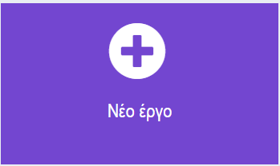

## Αρχική οθόνη

Μπορεί να θέλεις οι φίλοι/ες και η οικογένειά σου να μοιράζονται και να χρησιμοποιούν τον έλεγχο της διάθεσης που δημιούργησες.

Αυτό σημαίνει ότι πρέπει να δημιουργήσεις μια αρχική οθόνη για να εμφανίσεις ορισμένες οδηγίες για τον τρόπο χρήσης.

<p style="border-left: solid; border-width:10px; border-color: #0faeb0; background-color: aliceblue; padding: 10px;">
  <span style="color: #0faeb0">Ο σχεδιασμός της **εμπειρίας χρήστη** </span> είναι σημαντικό μέρος της δημιουργίας ενός προϊόντος. Σημαίνει να σκέφτεσαι τρόπους για να κάνεις τα προγράμματά σου εύκολα στην κατανόηση και τη χρήση.
</p>

### Επίλεξε το θέμα σου

\--- task ---

Σκέψου πότε γύρισες σπίτι από το σχολείο ή από μια έξοδο και η οικογένειά σου ή οι φίλοι σου σε ρώτησαν ρωτήσει πώς πήγε η μέρα σου. Τι απαντήσεις έδωσες;

Μπορεί να είχες πει:

- Είχα μια καλή μέρα
- Είχα μια OK μέρα
- Δεν είχα μια καλή μέρα

<p style="border-left: solid; border-width:10px; border-color: #0faeb0; background-color: aliceblue; padding: 10px;">
  <span style="color: #0faeb0">**Οι διαθέσεις**</span> είναι ο τρόπος που νιώθεις διαφορετικές ημέρες ή διαφορετικές ώρες της ημέρας. Μερικές φορές μπορεί να αισθάνεσαι πραγματικά χαρούμενος/η, όπως όταν παίζεις με τα αγαπημένα σου παιχνίδια ή περνάς χρόνο με φίλους/ες. Άλλες φορές, μπορεί να αισθάνεσαι λίγο λυπημένος/η ή κακόκεφος/η. Οι διαθέσεις μπορούν να αλλάξουν κατά τη διάρκεια της ημέρας και είναι εντάξει να έχεις διαφορετικές διαθέσεις.
</p>

Με βάση τη διάθεση που επιλέγει ο χρήστης σου, μπορείς να δημιουργήσεις απαντήσεις που χρησιμοποιούν:

- Κείμενο για εμφάνιση μηνύματος στον χρήστη
- Εικονίδια και κινούμενα σχέδια για να τους φτιάξουν το κέφι
- Μελωδίες και ήχοι για ηρεμία ή ενθουσιασμό

\--- /task ---

### Δημιούργησε το έργο σου

\--- task ---

Άνοιξε το πρόγραμμα επεξεργασίας MakeCode στη διεύθυνση [makecode.microbit.org](https://makecode.microbit.org){:target="_blank"}.

\--- collapse ---

---

## title: Εκτός σύνδεσης έκδοση του επεξεργαστή

Υπάρχει επίσης μια [έκδοση του προγράμματος επεξεργασίας MakeCode με δυνατότητα λήψης](https://makecode.microbit.org/offline-app){:target="_blank"}.

\--- /collapse ---

\--- /task ---

Μόλις ανοίξει το πρόγραμμα επεξεργασίας, δημιούργησε ένα νέο έργο και δώσε ένα όνομα στο έργο σου.

\--- task ---

Κάνε κλικ στο κουμπί **Νέο έργο**.



\--- /task ---

\--- task ---

**Συμβουλή:** Δώσε στο έργο σου ένα βοηθητικό όνομα που να σχετίζεται με το πρόγραμμα που δημιουργείς. Αυτό θα διευκολύνει την εύρεσή του εάν δημιουργήσεις και άλλα έργα στο MakeCode.

\--- /task ---

### Δημιούργησε την αρχική οθόνη

Δημιούργησε μια αρχική οθόνη που εμφανίζει στο χρήστη ποιον σκοπό εξυπηρετεί η συσκευή σου και πώς να τη χρησιμοποιεί.

Θα το κάνεις αυτό με το μπλοκ `κατά την έναρξη`{:class='microbitbasic'} του νέου σου έργου.

\--- task ---

Πρόσθεσε μερικά μπλοκ `Βασικά`{:class='microbitbasic'} στο μπλοκ `κατά την έναρξη`{:class='microbitbasic'}. Τα μπλοκ που θα επιλέξεις θα εξαρτηθούν από το τι θέλεις να δει ο χρήστης σου όταν ξεκινά το πρόγραμμα.

Θα μπορούσες να εμφανίσεις ένα **εικονίδιο**, να δημιουργήσεις μια **κινούμενη εικόνα** ή να εμφανίσεις **κείμενο**.

Για παράδειγμα, θα μπορούσε να εμφανίσει μια καρδιά.

```microbit
basic.showIcon(IconNames.Heart)
```

[[[microbit-icons]]]

[[[microbit-animation]]]

[[[microbit-text]]]

Εάν η αρχική οθόνη είναι περίπλοκη, ίσως να ήταν καλή ιδέα να οργανώσεις τον κώδικα σε μια **συνάρτηση**.

[[[microbit-function]]]

\--- /task ---

\--- task ---

Δοκίμασε την οθόνη σου, δείξε την σε έναν/μια φίλο/η και δες αν καταλαβαίνει τι κάνει το πρόγραμμα.

\--- /task ---

### Επιλογή διάθεσης

Το πρόγραμμά σου θα πρέπει να ρωτήσει τον χρήστη για την ημέρα του και να τον αφήσει να διαλέξει από τις επιλογές που έχουν οριστεί.

\--- task ---

Πρόσθεσε οδηγίες στο μπλοκ `κατά την έναρξη`{:class='microbitbasic'} χρησιμοποιώντας `εμφάνισε συμβολοσειρά`{:class='microbitbasic'}.

Οι οδηγίες πρέπει να λένε στον χρήστη πώς να επιλέξει την κάθε διάθεση.

Αυτό θα βοηθήσει τον χρήστη να γνωρίζει ποιες χειρονομίες να χρησιμοποιήσει για να εισαγάγει τη διάθεσή του.

[[[microbit-text]]]

Θυμήσου: Το κείμενο σε ένα micro:bit παίρνει πολύ χρόνο για να κυλήσει, οπότε κράτα το κείμενό σου σύντομο.

\--- /task ---

\--- task ---

Πρόσθεσε εικονίδια αντιπροσωπευτικά της κάθε διάθεσης.

[[[microbit-icons]]]

\--- /task ---

### Επίλεξε τρεις διαθέσεις

\--- task ---

Τώρα πρέπει να προσθέσεις χειρονομίες για την κάθε διάθεση.
Πρέπει να προσθέσεις μία χειρονομία για μια:

- Καλή μέρα
- OK ημέρα
- Κακή ημέρα

[[[microbit-gesture-trigger]]]

\--- /task ---

### Δημιούργησε μία μεταβλητή

\--- task ---

Δημιούργησε μία νέα μεταβλητή με όνομα 'διάθεση\`.

[[[microbit-create-variables]]]

\--- /task ---

\--- task ---

Πρόσθεσε την μεταβλητή στο μπλοκ `χειρονομίας`{:class='microbitinput'}.

Παρακάτω είναι ένα παράδειγμα του προγράμματος με μπλοκ που θα μπορούσες να φτιάξεις:

```microbit
input.onGesture(Gesture.Shake, function () {
    mood = 0
})
```

\--- /task ---

\--- task ---

Θα χρειαστεί επίσης να χρησιμοποιήσεις έναν αριθμό που θα αντιπροσωπεύει την κάθε διάθεση.

Για παράδειγμα, η "Καλή μέρα" θα μπορούσε να είναι "1", η "OK ημέρα" θα μπορούσε να είναι "2" και η "Κακή μέρα" θα μπορούσε να είναι "3".

Άλλαξε την μεταβλητή "0" σε "1" στη μεταβλητή "ορισμός διάθεση"{:class='microbitvariables'} για να ταιριάζει με τη σωστή διάθεση.

```microbit
input.onGesture(Gesture.Shake, function () {
    mood = 1
})
```

\--- /task ---

\--- task ---

Θα μπορούσες να εμφανίσεις ένα **εικονίδιο** ή μια **κινούμενη εικόνα** για να απεικονίσεις την κάθε διάθεση. Θα μπορούσες επίσης να σχεδιάσεις κάτι χρησιμοποιώντας το `show leds`{:class='microbitbasic'}.

[[[microbit-icons]]]

[[[microbit-animation]]]

Το μπλοκ συμβάντων θα πρέπει τώρα να μοιάζει κάπως έτσι (τα ακριβή μπλοκ μπορεί να είναι διαφορετικά):

```microbit
input.onGesture(Gesture.Shake, function () {
    mood = 1
    basic.showLeds(`
        # # . # #
        . . . . .
        . . # . #
        . # # # .
        . # # # .
        `)
})
```

\--- /task ---

\--- task ---

Επανάλαβε αυτά τα βήματα δύο φορές, ώστε να έχεις μπλοκ για κάθε χειρονομία.

\--- /task ---

\--- task ---

Στο μπλοκ "χειρονομία"{:class='microbitinput'}, πες στον χρήστη να χρησιμοποιήσει ένα "συμβάν" για να ορίσει τη διάθεσή του. Στο παράδειγμά μας, του είπαμε να πατήσει το κουμπί A.

[[[microbit-text]]]

Για καλύτερη εμπειρία χρήστη, πρόσθεσε ένα μπλοκ "παύση"{:class='microbitbasic'} και ένα "καθαρισμό οθόνης"{:class='microbitbasic'} μεταξύ του εικονιδίου της διάθεσης και του μπλοκ οδηγιών.

```microbit
input.onGesture(Gesture.Shake, function () {
    mood = 1
    basic.showLeds(`
        # # . # #
        . . . . .
        . . # . #
        . # # # .
        . # # # .
        `)
    basic.pause(100)
    basic.clearScreen()
    basic.showString("Press A")
})
```

\--- /task ---

### Δοκίμασε το έργο σου

\--- task ---

Κατά την επανεκκίνηση του προσομοιωτή, έλεγξε ότι είσαι ευχαριστημένος/η με τις οδηγίες, τα εικονίδια και τα κινούμενα σχέδια για την αρχική σου οθόνη.

'Ελεγξε ότι όταν χρησιμοποιείς μια χειρονομία όπως ένα μπλοκ `στο κλίση δεξιά`{:class='microbitinput'}, εμφανίζεται το σωστό εικονίδιο ή κινούμενο σχέδιο για τη διάθεση.

\--- /task ---
