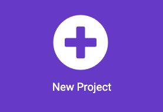

## Start up screen

You may want your mood checker to be used by your friends and family. 

This means you can create a start-up screen to show instructions on how to use your program.

<p style="border-left: solid; border-width:10px; border-color: #0faeb0; background-color: aliceblue; padding: 10px;">
  <span style="color: #0faeb0">**User experience**</span> design is an important part of creating a product. It means thinking about ways to make your programs easy to understand and use.
</p>

### Choose your mood and responses

--- task ---

Think about the times you've gotten back from school or from an outing.
Your family or friends might have asked how your day went. What responses have you given?

You might have said:
+ I had a good day
+ I had an okay day
+ I didn't have a good day

[Boxout about moods and mental health]

Based on the mood, you can create responses that use:

+ Icons and animations to cheer them up
+ Light, temperature or sound sensors to track their environment
+ Melodies and sounds for calmness or excitement

You can choose any response to create a program for.

--- /task ---

### Create your project

--- task ---

Open the MakeCode editor at [makecode.microbit.org](https://makecode.microbit.org){:target="_blank"}

--- collapse ---

---
title: Offline version of the editor
---

There is also a [downloadable version of the MakeCode editor](https://makecode.microbit.org/offline-app){:target="_blank"}.

--- /collapse ---

--- /task ---

Once the editor is open, you will need to create a new project and give your project a name. 

--- task ---

Click on the **New Project** button.



--- /task ---

--- task ---

**Tip:** Give your project a helpful name that relates to the program you’re creating. This will make it easier to find if you create other projects on MakeCode.

--- /task ---


### Make your start up screen

Create a start-up screen that shows your user what your device is for and how to use it.

You should make this in the `on start`{:class='microbitbasic'} block of your new project. 

--- task ---

Add some `Basic`{:class='microbitbasic'} blocks to your `on start`{:class='microbitbasic'} block that your user will see when the program starts.

You could show an **icon**, make an **animation** or display a **string**.

For instance it could show the heart logo.

```microbit
basic.showString("How's your day?")
```

[[[microbit-icons]]]

[[[microbit-animation]]]

[[[microbit-text]]]

If your start-up screen is complicated you might want to organise the code into a **function**.

[[[microbit-function]]]

--- /task ---

--- task ---

Test your screen, show it to a friend and see if they know what the program does. 

--- /task ---

### Choosing a mood for the day

You want to make sure that your program asks the user about their day and they can choose from your set options.

For any mood chosen, you can then give them a response activity or show them a response.

You can use input gestures to help the user choose their mood.

--- task ---

Add instructions (using the `show string`{:class='microbitbasic'}) to the `on start`{:class='microbitbasic'} block.

This will help the user knows what gestures to use.

[[[microbit-text]]]

--- /task ---

--- task ---

Add icons to represent each mood.

[[[microbit-icons]]]

--- /task ---

--- task ---

You now need to add gestures for each mood. 
You need to add one gesture each for:
+ Good day
+ Okay day
+ Bad day

[[[microbit-gesture-trigger]]]

--- /task ---

### Create a variable

--- task ---

Create a variable called `mood`. 

[[[microbit-create-variables]]]

--- /task ---

--- task ---

At the variable to the top of your `gesture`{:class='microbitinput'} block,

`set`{:class='microbitvariables'} your `mood`{:class='microbitvariables'} variable to the corresponding mood. 

Here is an example of the code blocks you could use:

```microbit
input.onGesture(Gesture.Shake, function () {
    mood = "Okay day"
})
```

--- /task ---

--- task ---

From the `Advanced `section of the Toolbox, drag out an empty text block from the `Text`{:class='microbittext'} menu.

Place it inside the `0` in the `set mood`{:class='microbitvariables'} block.

You can then type which mood the variable should be set to.

--- /task ---

--- task ---

You could show an **icon** or an **animation** to represent each mood.

[[[microbit-icons]]]

[[[microbit-animation]]]

Your event should now look something like this (the exact blocks could look different):

```microbit
input.onGesture(Gesture.TiltRight, function () {
    mood = "Bad day"
    basic.showLeds(`
        # # . # #
        . . . . .
        . . # . .
        . # # # .
        # . . . #
        `)
})
```

--- /task ---

### Test your program

--- task ---

Test your program. 

When the simulator restarts, check that you're happy with the instructions, icons and animation for your start-up screen.

Check that when you use a gesture such as a `Tilt`{:class='microbitinput'} block, the correct mood icon or animation is shown.

--- /task ---


