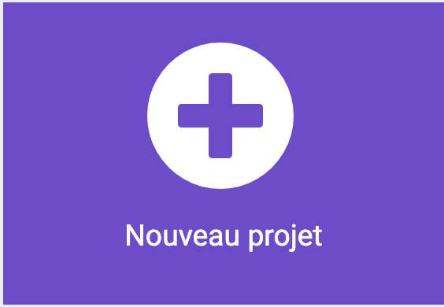

## Page d'accueil

Tu aimerais peut-être que tes ami·e·s et ta famille partagent et utilisent ton vérificateur d'humeur.

Cela signifie que tu dois créer une page d'accueil pour afficher quelques instructions concernant la méthode d'utilisation.

<p style="border-left: solid; border-width:10px; border-color: #0faeb0; background-color: aliceblue; padding: 10px;">
  Le design de <span style="color: #0faeb0">**l'expérience utilisateur·trice**</span> est un élément important lors de la création d'un produit. Cela signifie qu'il faut réfléchir aux moyens de rendre tes programmes faciles à comprendre et à utiliser.
</p>

### Choisir ton thème

--- task ---

Pense aux moments où tu rentres de l'école ou d'une sortie et où ta famille ou tes ami·e·s te demandent comment s'est passée ta journée. Quelles réponses as-tu données ?

Tu aurais pu dire :

- J'ai passé une bonne journée
- J'ai passé une journée passable
- Je n'ai pas passé une bonne journée

<p style="border-left: solid; border-width:10px; border-color: #0faeb0; background-color: aliceblue; padding: 10px;">
  <span style="color: #0faeb0">**Les humeurs**</span> sont la façon dont tu te sens selon les jours ou les moments de la journée. Parfois tu peux te sentir très heureux, par exemple, lorsque tu joues avec tes jouets préférés ou que tu passes du temps avec tes ami·e·s. À d'autres moments, tu te sens peut-être un peu triste ou grognon. Les humeurs peuvent changer au cours de la journée, et c'est normal d'avoir des humeurs différentes.
</p>

En fonction de l'humeur choisie par ton utilisateur·trice, tu peux créer des réponses qui utilisent :

- Du texte pour afficher un message à l'utilisateur·trice
- Des icônes et des animations pour lui remonter le moral
- Des mélodies et des sons pour le calme ou l'excitation

--- /task ---

### Créer ton projet

--- task ---

Ouvre l'éditeur MakeCode sur [makecode.microbit.org](https://makecode.microbit.org){:target="_blank"}.

--- collapse ---

---
title: Version hors ligne de l'éditeur
---

Il existe également une [version téléchargeable de l'éditeur MakeCode](https://makecode.microbit.org/offline-app){:target="_blank"}.

--- /collapse ---

--- /task ---

Une fois que l'éditeur est ouvert, crée un nouveau projet et donne un nom à ton projet.

--- task ---

Clique sur le bouton **Nouveau projet**.



--- /task ---

--- task ---

**Astuce  :** Donne à ton projet un nom pratique en rapport avec le programme que tu crées. Cela permettra de le retrouver plus facilement si tu crées d'autres projets sur MakeCode.

--- /task ---

### Créer ton écran de démarrage

Créer un écran de démarrage qui montre à ton utilisateur·trice à quoi sert ton appareil et comment l'utiliser.

Tu le feras dans le bloc `au démarrage`{:class='microbitbasic'} de ton nouveau projet.

--- task ---

Ajoute quelques blocs `Base`{:class='microbitbasic'} à ton bloc `au démarrage`{:class='microbitbasic'}. Les blocs que tu choisis dépendent de ce que tu souhaites que ton utilisateur·trice voie au démarrage du programme.

Tu peux afficher un **icône**, faire une **animation** ou afficher un **texte**.

Par exemple, il pourrait afficher un coeur.

```microbit
basic.showIcon(IconNames.Heart)
```

[[[microbit-icons]]]

[[[microbit-animation]]]

[[[microbit-text]]]

Si ton écran de démarrage est compliqué, tu peux organiser le code dans une **fonction**.

[[[microbit-function]]]

--- /task ---

--- task ---

Teste ton écran, montre-le à un·e ami·e et voit s'il ou elle a compris ce que fait le programme.

--- /task ---

### Sélectionne une humeur

Ton programme devrait demander à l'utilisateur·trice comment s'est passé sa journée et le ou la laisser choisir parmi des options définies.

--- task ---

Ajoute des instructions au bloc `au démarrage`{:class='microbitbasic'} en utilisant `afficher texte`{:class='microbitbasic'}.

Les instructions doivent indiquer à l'utilisateur·trice comment sélectionner chaque humeur.

Cela aidera l'utilisateur·trice à savoir quels gestes utiliser pour exprimer son humeur.

[[[microbit-text]]]

N'oublie pas : le texte sur un micro:bit prend beaucoup de temps à défiler, alors garde ton texte court.

--- /task ---

--- task ---

Ajoute des icônes pour représenter chaque humeur.

[[[microbit-icons]]]

--- /task ---

### Choisir trois humeurs

--- task ---

Tu dois maintenant ajouter des gestes pour chaque humeur.
Tu dois ajouter un geste pour :

- Bonne journée
- Journée passable
- Mauvaise journée

[[[microbit-gesture-trigger]]]

--- /task ---

### Créer une variable

--- task ---

Crée une nouvelle variable appelée « humeur ».

[[[microbit-create-variables]]]

--- /task ---

--- task ---

Ajoute la variable à ton bloc `geste`{:class='microbitinput'}.

Voici un exemple de blocs de code que tu pourrais utiliser :

```microbit
input.onGesture(Gesture.Shake, function () {
    humeur = 0
})
```

--- /task ---

--- task ---

Tu auras aussi besoin d'utiliser un nombre pour représenter chaque humeur.

Par exemple, `Bonne journée` pourrait être `1`, `Journée passable` pourrait être `2`, et `Mauvaise journée` pourrait être `3`.

Change le `0` en `1` dans ta variable `définir humeur`{:class='microbitvariables'} pour correspondre à la bonne humeur.

```microbit
input.onGesture(Gesture.Shake, function () {
    humeur = 1
})
```

--- /task ---

--- task ---

Tu peux afficher une **icône** ou une **animation** pour représenter chaque humeur. Tu peux également dessiner quelque chose en utilisant `montrer LEDs`{:class='microbitbasic'}.

[[[microbit-icons]]]

[[[microbit-animation]]]

Votre bloc évènement devrait maintenant ressembler à ça (les blocs exacts pourraient être un peu différents) :

```microbit
input.onGesture(Gesture.Shake, function () {
    humeur = 1
    basic.showLeds(`
        # # . # #
        . . . . .
        . . # . #
        . # # # .
        . # # # .
        `)
})
```

--- /task ---

--- task ---

Répète ces étapes deux fois pour avoir des blocs pour chaque geste.

--- /task ---

--- task ---

Dans ton bloc `geste`{:class='microbitinput'}, dis à l'utilisateur·trice d'utiliser un `évènement` pour définir son humeur. Dans notre exemple, on lui a dit d'appuyer sur le `Bouton A`.

[[[microbit-text]]]

Pour une meilleure expérience utilisateur·trice, ajoute un bloc `pause`{:class='microbitbasic'} et un bloc `effacer l'écran`{:class='microbitbasic'} entre l'icône d'humeur et le bloc d'instructions.

```microbit
input.onGesture(Gesture.Shake, function () {
    humeur = 1
    basic.showLeds(`
        # # . # #
        . . . . .
        . . # . #
        . # # # .
        . # # # .
        `)
    basic.pause(100)
    basic.clearScreen()
    basic.showString("Press A")
})
```

--- /task ---

### Tester ton programme

--- task ---

Lorsque le simulateur redémarre, vérifie que tu es satisfait·e des instructions, des icônes et de l'animation de ton écran de démarrage.

Vérifie que lorsque tu utilises un geste tel qu'un bloc `lorsque incliner à droite` {:class='microbitinput'}, l'icône d'humeur ou l'animation correcte s'affiche.

--- /task ---


