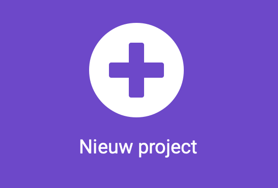

## Startscherm

Misschien wil je dat je vrienden en familie je stemmingschecker delen en gebruiken.

Dit betekent dat je een startscherm moet maken om wat instructies te tonen voor het gebruik ervan.

<p style="border-left: solid; border-width:10px; border-color: #0faeb0; background-color: aliceblue; padding: 10px;">
  Het ontwerpen van de <span style="color: #0faeb0">**gebruikerservaring**</span> is een belangrijk onderdeel van het maken van een product. Het betekent dat je nadenkt over manieren hoe je je programma's zo kunt maken dat ze gemakkelijk te begrijpen en te gebruiken zijn.
</p>

### Kies je thema

\--- task ---

Beeld je eens in dat je thuiskomt van school of van een dagje uit en je familie of vrienden hebben vragen hoe je dag was. Welke antwoorden heb je dan al eens gegeven?

Je hebt misschien gezegd:

- Ik heb een goede dag gehad
- Ik heb een ok dag gehad
- Ik heb geen goede dag gehad

<p style="border-left: solid; border-width:10px; border-color: #0faeb0; background-color: aliceblue; padding: 10px;">
  <span style="color: #0faeb0">**Stemmingen**</span> zijn de manier waarop je je voelt op verschillende dagen of op verschillende tijdstippen van de dag. Soms zou je je heel blij kunnen voelen, bijvoorbeeld wanneer je speelt met je favoriete speelgoed of tijd doorbrengt met vrienden. Andere keren voel je je misschien een beetje verdrietig of chagrijnig. Stemmingen kunnen gedurende de dag veranderen, en het is prima om verschillende stemmingen te hebben.
</p>

Op basis van de stemming die jouw gebruiker kiest, kun je antwoorden maken die gebruik maken van:

- Tekst om de gebruiker een bericht te laten zien
- Pictogrammen en animaties om ze op te vrolijken
- Melodieën en geluiden voor kalmte of opwinding

\--- /task ---

### Maak je project

\--- task ---

Open de MakeCode editor in [makecode.microbit.org](https://makecode.microbit.org){:target="_blank"}.

\--- collapse ---

---

## title: Offline versie van de editor

Er is ook een [downloadbare versie van de MakeCode-editor](https://makecode.microbit.org/offline-app){:target="_blank"}.

\--- /collapse ---

\--- /task ---

Zodra de editor is geopend, moet je een nieuw project aanmaken en je project een naam geven.

\--- task ---

Klik op de knop **Nieuw project**.



\--- /task ---

\--- task ---

**Tip:** Geef je project een logische naam die betrekking heeft op het programma dat je aan het maken bent. Dit maakt het gemakkelijker om het terug te vinden als je nog andere projecten aanmaakt op MakeCode.

\--- /task ---

### Maak je startscherm

Maak een startscherm dat aan je gebruiker laat zien waar je apparaat voor gemaakt is en hoe je het gebruikt.

Je maakt dit in het `bij opstarten`{:class='microbitbasic'} blok van je nieuwe project.

\--- task ---

Vanuit het blokmenu Basis{:class='microbitbasic'} sleep je enkele blokken naar het 'bij opstarten'{:class='microbitbasic'} blok. De blokken die je kiest zijn afhankelijk van wat je wilt dat je gebruiker ziet wanneer het programma start.

Je kunt een **pictogram**, een **animatie** of **tekst** laten zien.

Het zou bijvoorbeeld een hart kunnen laten zien.

```microbit
basic.showIcon(IconNames.Heart)
```

[[[microbit-icons]]]

[[[microbit-animation]]]

[[[microbit-text]]]

Als het startscherm ingewikkeld is, kun je de code overzichtelijker maken met behulp van een **functie**.

[[[microbit-function]]]

\--- /task ---

\--- task ---

Test je scherm, laat het aan een vriend of vriendin zien en kijk of ze begrijpen wat het programma doet.

\--- /task ---

### Selecteer een stemming

Je programma gaat de gebruiker vragen over zijn dag en laat hem kiezen uit enkele opties.

\--- task ---

Voeg instructies toe aan het `bij opstarten`{:class='microbitbasic'} blok door `toon tekens`{:class='microbitbasic'} te gebruiken.

De instructies moeten de gebruiker vertellen hoe hij een stemming kan selecteren.

Dit helpt de gebruiker om te weten welke gebaren hij moet gebruiken om zijn stemming in te vullen.

[[[microbit-text]]]

Let op: het scrollen van tekst op een micro:bit duurt lang, dus houd je tekst kort.

\--- /task ---

\--- task ---

Voeg pictogrammen toe om elke stemming weer te geven.

[[[microbit-icons]]]

\--- /task ---

### Kies drie stemmingen

\--- task ---

Je moet nu voor elke stemming gebaren toevoegen.
Je moet een gebaar toevoegen voor:

- Goede dag
- Ok dag
- Niet zo'n goede dag

[[[microbit-gesture-trigger]]]

\--- /task ---

### Maak een variabele

\--- task ---

Maak een variabele met de naam `stemming`.

[[[microbit-create-variables]]]

\--- /task ---

\--- task ---

Voeg de variabele toe aan je `gebaar`{:class='microbitinput'} blok.

Hier is een voorbeeld van de codeblokken die je zou kunnen gebruiken:

```microbit
input.onGesture(Gesture.Shake, function () {
    mood = 0
})
```

\--- /task ---

\--- task ---

Je moet ook een getal gebruiken om elke stemming weer te geven.

'Goede dag' kan bijvoorbeeld '1' zijn, 'Ok dag' kan '2' zijn en 'Niet zo'n goede dag' kan '3' zijn.

Verander de `0` naar `1` in je `stel stemming in op`{:class='microbitvariables'} variabele zodat deze overeenkomt met de juiste stemming.

```microbit
input.onGesture(Gesture.Shake, function () {
    mood = 1
})
```

\--- /task ---

\--- task ---

Je kunt een **pictogram** of een **animatie** tonen om elke stemming weer te geven. Je kunt ook iets tekenen met `toon lichtjes`{:class='microbitbasic'}.

[[[microbit-icons]]]

[[[microbit-animation]]]

Je gebeurtenis blok zou er nu zo uit moeten zien (de precieze blokken kunnen verschillend zijn):

```microbit
input.onGesture(Gesture.Shake, function () {
    mood = 1
    basic.showLeds(`
        # # . # #
        . . . . .
        . . # . #
        . # # # .
        . # # # .
        `)
})
```

\--- /task ---

\--- task ---

Herhaal deze stappen twee keer zodat je blokken hebt voor elk gebaar.

\--- /task ---

\--- task ---

Vertel de gebruiker in je `gebaar`{:class='microbitinput'} blok een `gebeurtenis` te gebruiken om zijn of haar stemming te bepalen. In ons voorbeeld hebben we ze verteld dat ze op 'Knop A' moeten drukken.

[[[microbit-text]]]

Voor een betere gebruikerservaring, voeg een `pauzeer (ms)`{:class='microbitbasic'} en een `wis scherm`{:class='microbitbasic'} blok toe tussen het stemmingspictogram en het instructieblok.

```microbit
input.onGesture(Gesture.Shake, function () {
    mood = 1
    basic.showLeds(`
        # # . # #
        . . . . .
        . . # . #
        . # # # .
        . # # # .
        `)
    basic.pause(100)
    basic.clearScreen()
    basic.showString("Press A")
})
```

\--- /task ---

### Test je programma

\--- task ---

Als de simulator opnieuw opstart, controleer dan of je tevreden bent met de instructies, pictogrammen en animaties voor je startscherm.

Controleer of wanneer je een gebaar zoals een `naar rechts kantelen`{:class='microbitinput'} blok gebruikt, het juiste stemmingspictogram of animatie wordt getoond.

\--- /task ---


